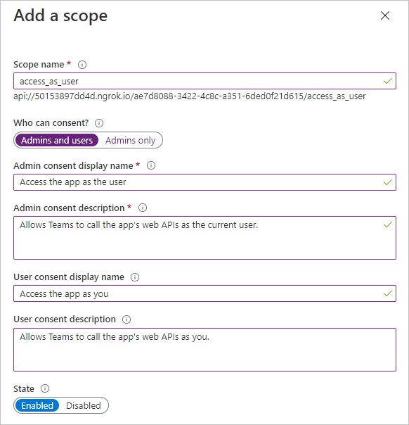

<!-- markdownlint-disable MD002 MD041 -->

Neste exercício, você criará um novo registro de aplicativo Web do Azure AD usando o centro de administração do Azure Active Directory.

1. Abra um navegador e navegue até o [centro de administração do Azure Active Directory](https://aad.portal.azure.com). Faça logon usando uma **conta pessoal** (também conhecida como Conta da Microsoft) ou **Conta Corporativa ou de Estudante**.

1. Selecione **Azure Active Directory** na navegação esquerda e selecione **Registros de aplicativos** em **Gerenciar**.

    

1. Selecione **Novo registro**. Na página **registrar um aplicativo** , defina os valores da seguinte maneira, onde `YOUR_NGROK_URL` é a URL de encaminhamento ngrok que você copiou na seção anterior.

    - Defina **Nome** para `Teams Graph Tutorial`.
    - Defina **Tipos de conta com suporte** para **Contas em qualquer diretório organizacional e contas pessoais da Microsoft**.
    - Em **URI de Redirecionamento**, defina o primeiro menu suspenso para `Web` e defina o valor como `YOUR_NGROK_URL/authcomplete`.

    

1. Selecione **Registrar**. Na página **tutorial de gráfico do teams** , copie o valor da **ID do aplicativo (cliente)** e salve-o, você precisará dele na próxima etapa.

    

1. Selecione **Autenticação** em **Gerenciar**. Localize a seção **Grant implícita** e habilite **tokens de acesso** e **tokens de ID**. Selecione **Salvar**.

1. Selecione **Certificados e segredos** sob **Gerenciar**. Selecione o botão **Novo segredo do cliente**. Insira um valor em **Descrição** e selecione uma das opções para **expirar** e selecione **Adicionar**.

1. Copie o valor secreto do cliente antes de sair desta página. Você precisará dele na próxima etapa.

    > [!IMPORTANT]
    > Este segredo do cliente nunca é mostrado novamente, portanto, copie-o agora.

1. Selecione **permissões de API** em **gerenciar** e, em seguida, selecione **Adicionar uma permissão**.

1. Selecione **Microsoft Graph** e, em seguida, **permissões delegadas**.

1. Selecione as permissões a seguir e, em seguida, selecione **adicionar permissões**.

    - **Calendars. ReadWrite** : isso permitirá que o aplicativo Leia e grave no calendário do usuário.
    - **MailboxSettings. Read** : isso permitirá que o aplicativo obtenha o fuso horário, o formato de data e o formato de hora do usuário de suas configurações de caixa de correio.

    

## Configurar logon único do teams

Nesta seção, você atualizará o registro de aplicativo para dar suporte ao [logon único no Teams](/microsoftteams/platform/tabs/how-to/authentication/auth-aad-sso).

1. Selecione **expor uma API**. Selecione o link **definir** próximo a **URI da ID do aplicativo**. Insira o nome de domínio da URL de encaminhamento do ngrok (com uma barra "/" acrescentada ao final) entre as barras duplas de avanço e o GUID. A ID inteira deve ser semelhante a: `api://50153897dd4d.ngrok.io/ae7d8088-3422-4c8c-a351-6ded0f21d615` .

1. Na seção **escopos definidos por esta API** , selecione **Adicionar um escopo**. Preencha os campos da seguinte maneira e selecione **Adicionar escopo**.

    - **Nome do escopo:**`access_as_user`
    - **Quem pode consentir?: administradores e usuários**
    - **Nome para exibição do consentimento do administrador:**`Access the app as the user`
    - **Descrição do consentimento do administrador:**`Allows Teams to call the app's web APIs as the current user.`
    - **Nome para exibição do consentimento do usuário:**`Access the app as you`
    - **Descrição do consentimento do usuário:**`Allows Teams to call the app's web APIs as you.`
    - **Estado: habilitado**

    

1. Na seção **aplicativos cliente autorizados** , selecione **Adicionar um aplicativo cliente**. Insira uma ID de cliente na lista a seguir, habilite o escopo em **escopos autorizados** e selecione **Adicionar aplicativo**. Repita esse processo para cada uma das IDs de cliente na lista.

    - `1fec8e78-bce4-4aaf-ab1b-5451cc387264` (Aplicativo móvel/aplicativo de área de trabalho do Microsoft Teams)
    - `5e3ce6c0-2b1f-4285-8d4b-75ee78787346` (Aplicativo Web do Teams)
